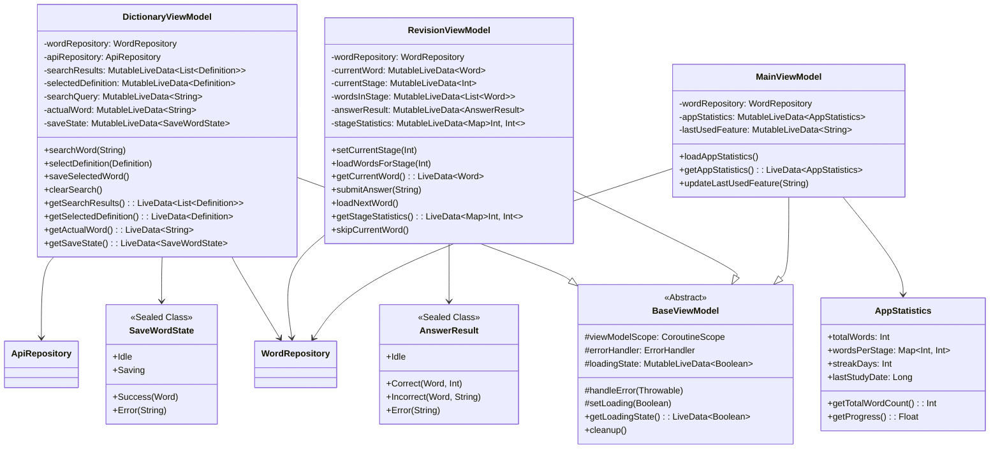

# Class Diagrams (UML)
## English Learning Android App

### 1. High-Level Architecture Class Diagram

### 2. Data Model Class Diagram

### 3. Repository Pattern Class Diagram

### 4. ViewModel Architecture Class Diagram

### 5. Database Layer Class Diagram

### 6. API Integration Class Diagram

### 7. UI Component Class Diagram

### 8. Utility Classes Diagram

---

## Class Diagram Notes

### Design Patterns Used:
1. **MVVM (Model-View-ViewModel)**: Separates UI logic from business logic
2. **Repository Pattern**: Abstracts data sources and provides a clean API
3. **Singleton Pattern**: Database instance, Retrofit instance
4. **Observer Pattern**: LiveData for reactive UI updates
5. **Factory Pattern**: Database creation, ViewModels
6. **Sealed Classes**: Type-safe state management

### Key Relationships:
- **Composition**: Activities contain ViewModels, ViewModels contain Repositories
- **Dependency Injection**: Repositories injected into ViewModels
- **Inheritance**: All Activities extend BaseActivity
- **Association**: Loose coupling between layers

### Threading Considerations:
- Database operations on background threads
- Network calls on IO dispatcher
- UI updates on main thread
- Coroutines for asynchronous operations

### Error Handling Strategy:
- Centralized error handling in BaseViewModel
- Type-safe error states using sealed classes
- User-friendly error messages
- Logging for debugging purposes
