# Flow Diagrams
## English Learning Android App

### 1. User Flow Diagram

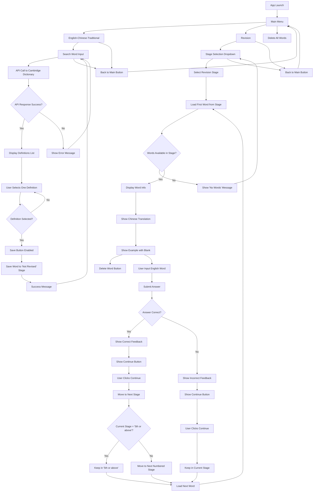

### 2. Data Flow Diagram

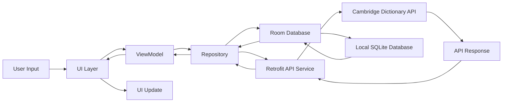

### 3. Application Architecture Flow

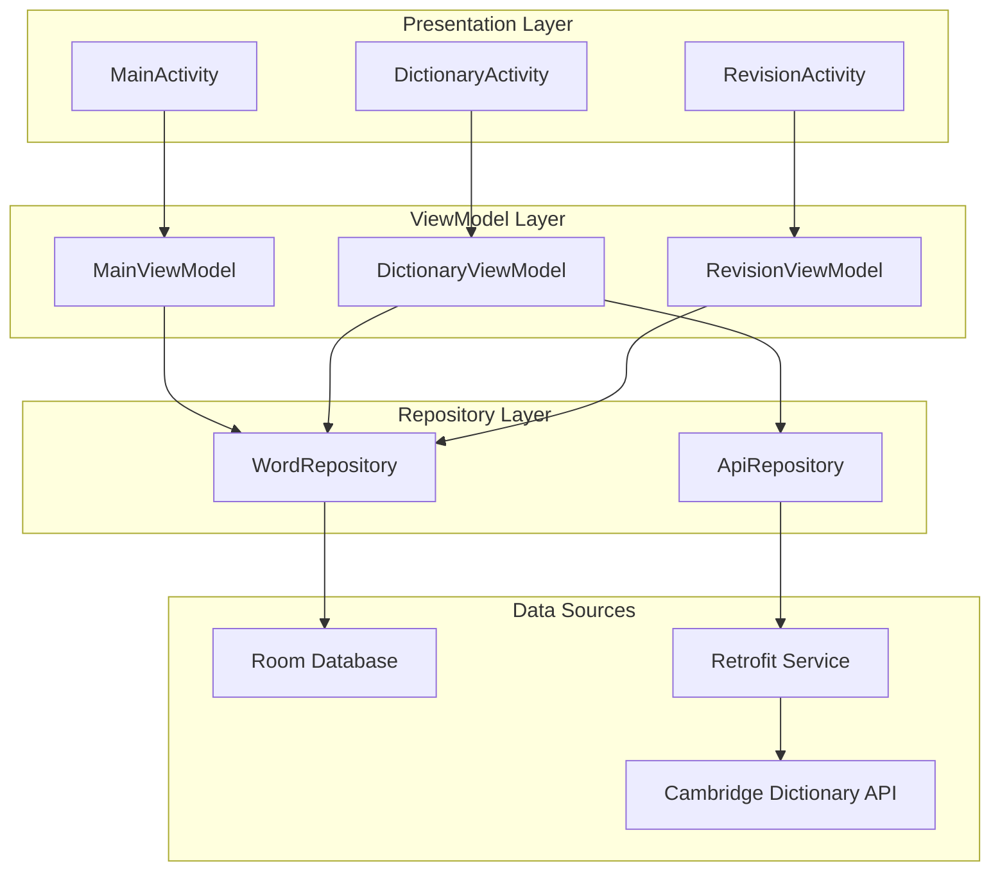

### 4. Database Operations Flow

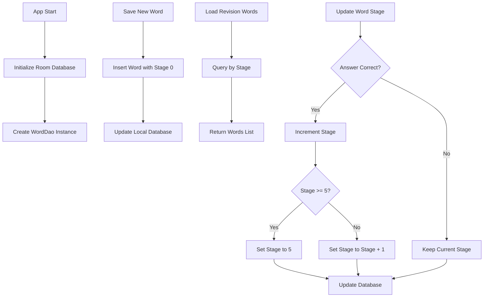

### 5. API Integration Flow

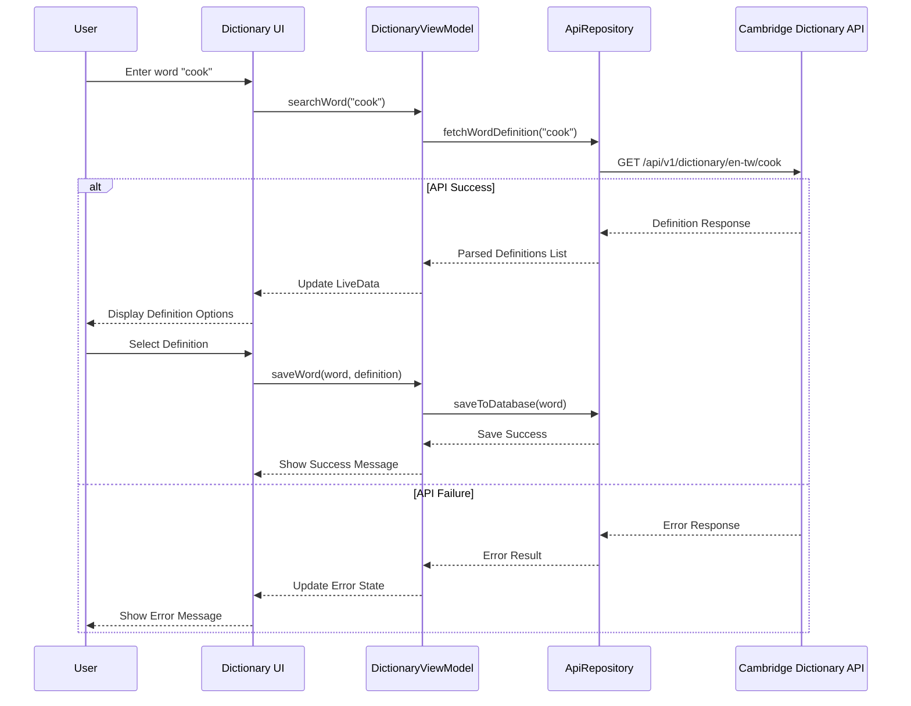

### 6. Revision System Flow

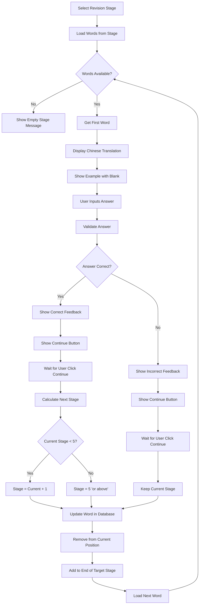

### 7. Navigation Flow

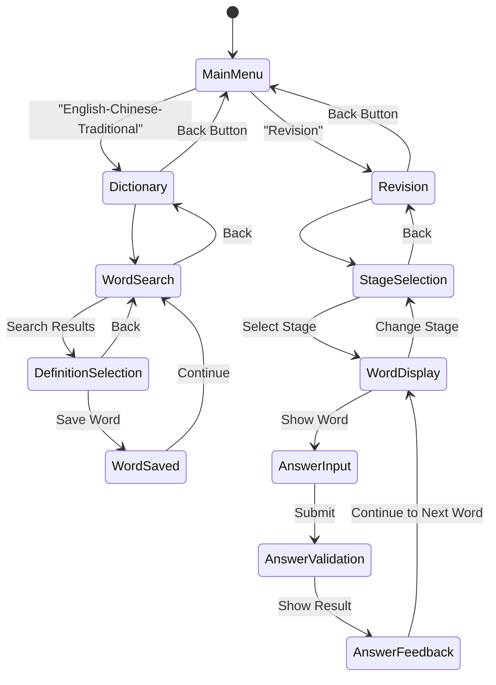

### 8. Error Handling Flow

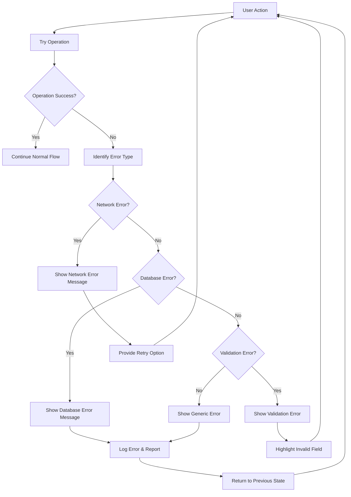

### 9. Stage Progression Logic Flow

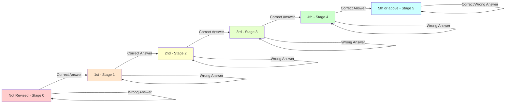

### 10. Performance Optimization Flow

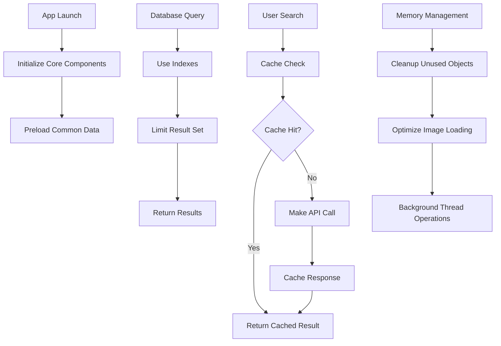

---

## Flow Diagram Legend

### Symbols Used:
- **Rectangle**: Process/Action
- **Diamond**: Decision Point
- **Circle**: Start/End Point
- **Parallelogram**: Input/Output
- **Arrow**: Flow Direction

### Color Coding:
- **Red**: Error States
- **Green**: Success States
- **Yellow**: Warning/Pending States
- **Blue**: Information States

### 3. Delete Operations Flow

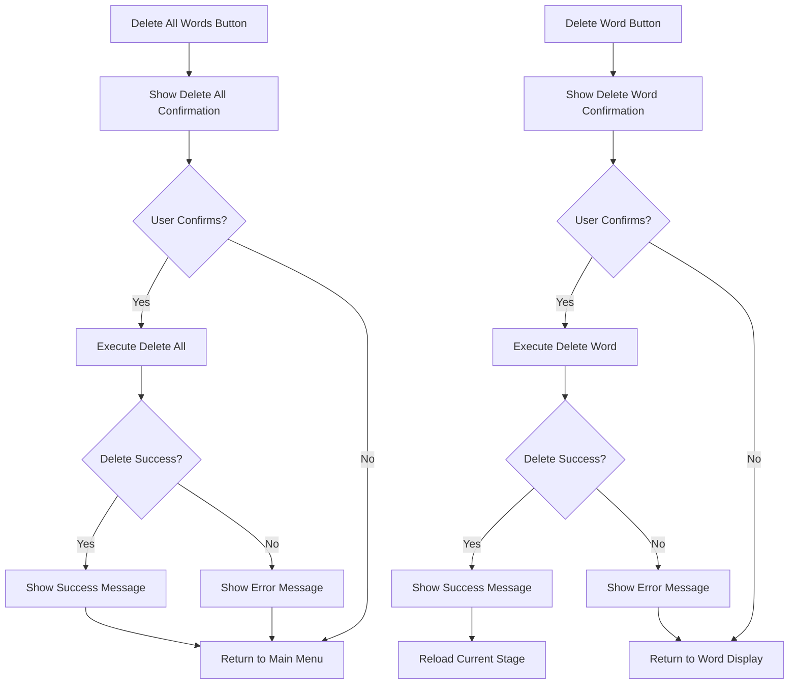

### Notes:
1. All flows are designed to handle both success and error scenarios
2. User can navigate back at any point using standard Android back button
3. Database operations are performed asynchronously to maintain UI responsiveness
4. API calls include timeout and retry mechanisms
5. Stage progression follows spaced repetition principles for optimal learning
6. Delete operations include confirmation dialogs to prevent accidental data loss
7. Individual word deletion refreshes the current stage view automatically
